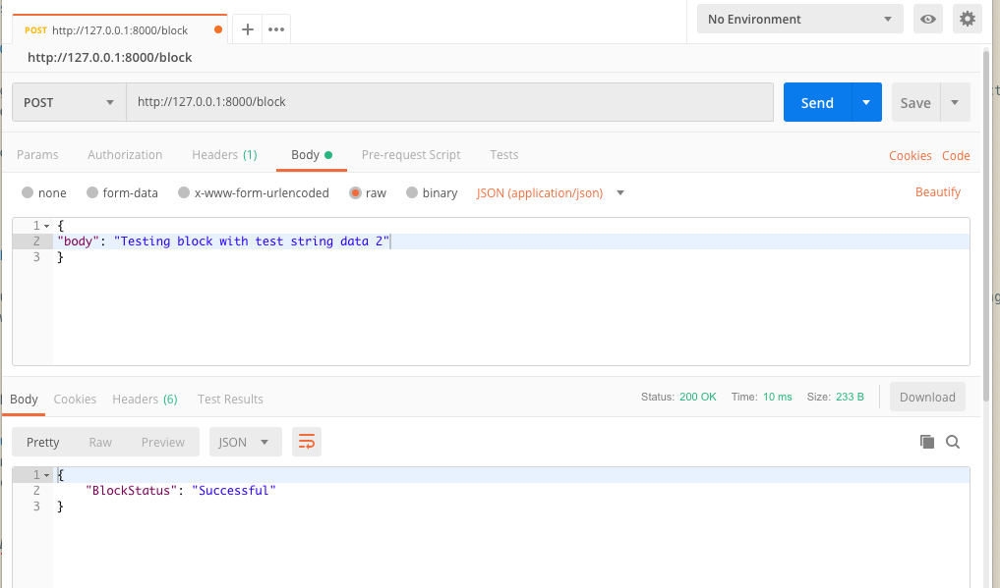

# Blockchain Data

Blockchain has the potential to change the way that the world approaches data. Develop Blockchain skills by understanding the data model behind Blockchain by developing your own simplified private blockchain.

## Getting Started

These instructions will get you a copy of the project up and running on your local machine for development and testing purposes.

### Prerequisites

Installing Node and NPM is pretty straightforward using the installer package available from the (Node.js® web site)[https://nodejs.org/en/].

### Configuring your project

- Use NPM to initialize your project and create package.json to store project dependencies.
```
npm init
```
- Install crypto-js with --save flag to save dependency to our package.json file
```
npm install crypto-js --save
```
- Install level with --save flag
```
npm install level --save
```
#### Web API

- Install fs
```
npm install fs
```
- Install express
```
npm install express
```
- Install bodyParser
```
npm install body-parser
```
- Install sanitize
```
npm install sanitize
```


## Files/Folders
```
project3-----|
             |----levelSandbox.js
             |
             |----RESTful_api.js
             |
             |
             |----chaindata
                      |
                      |---files to store the blockchain (NOT ADVISED TO CHANGE INSIDE CHAINDATA)
             |
             |----README.md

```          

#### levelSandbox.js

Contains leveldb class, this allows blocks on the chain to be persistent. The functions within the class are asynchronous meaning multiple operations can occur at once. Asynchronous operations are done through <a href = "https://developers.google.com/web/fundamentals/primers/promises">Promises </a> witch have to be dealt with appropriately.

#### RESTful_api.js

Consist of two classes, Block class and Blockchain class. Together creates a functional private blockchain. With the help of levelSandbox the block chain can be saved and reused.

Block class consist of only a constructor that describes the block object (hash,height,body,time,previousBlockHash).

BlockChain class contains asynchronous functions that handle the creation of the chain and the management of blocks on the chain. The reason for Blockchain functions to return Promise it allows the data from leveldb to be used without having unknown variables.

---


Express framework was used to create a RESTful api that accepts a get and post request. The get endpoint receives data through the URL path with a block height parameter. Example to get block zero <a href= http://localhost:8000/block/0>http://localhost/block/0</a>. This will return a JSON object of the block. Post endpoint receives data in the http payload as raw json. That data is then used as the block body, which is added to the chain.

---

#### chaindata

Blockchain data is stored. If a block is changed or a new chain is needed, chaindata folder can be deleted.


#### README.md

Your reading it!

### Code Flow
```

Express Web Service            Blockchain class           leveldb class
      |                             |                          |
      |--app.get()                  |--addBlock()              |-- addLevelDBData()
      |                             |                          |
      |--app.post()                 |--validateBlock()         |-- changeDBDate()
      |                             |                          |
                                    |--validateChain()         |-- getLevelDBData()
                                    |                          |
                                    |--getHeight()             |-- addDataToLevelDB()
                                    |                          |
                                    |--getBlock()              |-- getBlockCount()
                                                               |
                                                               |-- getChain()
```


#### Creating blocks/Genesis block and saving to leveldb


A check is done in the constructor of the BlockChain class that Promises to get the height of the saved chain. Using a leveldb function called getBlockCount() line[82 - 95] if nothing is returned a genesis block is created. Else we use the height to create a new block with the height of the last block created.


Using BlockCreator function to create new blocks line[292 - 310]. A timing and interval function that creates a defined amount of new block, that is passed to addBlock within in BlockChain class. addBlocks will then set block height, time, previousBlockhash and then a hash of the block itself. This is then passed to addDataToLevelDB within leveldb class to be saved.

```
BlockCreator()
      |
      |--addBlock()
            |
            |-- addDataToLevelDB()

```

#### Validate Block / Validate Chain

Validating a block is done in validateBlock in the BlockChain class.
First requesting a block by its height with getLevelDBData. The next step is to rehash the block to compare the hash in the block. If the hashes are not equal then the block has been change therefore invalid.


```
validateBlock()
      |
      |--getLevelDBData()
```

Validating the chain starts by requesting the height of the chain getBlockCount in leveldb. Then looping the the range of the blocks with getLevelDBData and comparing two things. First the last blocks hash with the current blocks previous hash and like validating a single block, rehashing the block. Only if both are true the chain is valid.

```
validateChain()
      |
      |--getBlocksCount()
     then
      |
      |--getLevelDBData()
```

#### get Block / chain height


getHeight function found in BlockChain Class utilizes getBlocksCount to return the height of the chain.

```
getHeight()
    |
    |--getBlocksCount()
```
getBlock function found in BlockChain class uses getLevelDBData to return a specific block.

```
getBlock()
    |
    |--getLevelDBData()
```

---

Get request for a specific block is made through the block chain class to first get the height of the chain, then the block it self.
```
app.get('/block/:index')
      |
      |--getHeight()
      |
      |--getBlock()
            |
            |--getLevelDBData()

```
Post request to create new block is made through the block chain class, add block.
```
app.post('/block')
      |
      |--addBlock()
```


### Managing the Private Blockchain


#### RESTful_api.js

To use RESTful_api.js to manage the blockchain use lines 313-328 for creating and validation.

First call out BlockCreator to generate some blocks. The two inputs are timing between block being created and amount of blocks to be created.
Recommend to stay above 1 sec per block (1 sec == 1000)

<u>NOTE</u> this will generate chaindata folder.

```
// Used to create blocks
BlockCreator(1000,5);
```
After creating blocks the functions below are available.
```
//validateChain
PrivateChain.validateChain();
```
Input: block you want to validate.
```
//validateBlock
PrivateChain.validateBlock(1);
```
```
//Get height of chain
PrivateChain.getHeight();
```
Input: block you want to inspect.
```
//Get single Block
PrivateChain.getBlock(1);
```

---

#### Error Handling / Sanitize user input

Handling errors is done throughout both endpoints. Both have appropriate responses if the server stops working (500) with a message to the client.
```
500 Internal Server Error

{
    "Server": "Oops I broke!"
}
```
Get request first sanitizes user input checking if its not a integer, if so response bad request (400) is sent back with a message. Else
check if the block requested exist, if so return block object (200). Else bad request (400) is sent to client, also telling how high the chain currently is.

```
//Tried to send a string
400 Bad request
{
    "Error": "Please enter a number."
}

//Successful request
200  OK
{
    "hash": "71d3c5fab59044afefef8ecf13ecc3e8d750af17788274601dd39cb41ff22f4f",
    "height": 0,
    "body": "First block in the chain - Genesis block",
    "time": "1545076056",
    "previousBlockHash": ""
}

//Block doesnt existence
400 Bad request
{
    "Error": "Block request is out of range. Current Height is 55."
}

```

Post request checks the length of the string is greater then zero. If so, bad request error (400) with a message is sent to client. Else
message is sent "block was successfully added" (200).

```
//Nothing in the string
400 Bad request
{
    "BlockStatus": "Failed (If this persist please revert to projects readme for example)"
}

// Block successfully added with data body from client
200 OK
{
    "BlockStatus": "Successful"
}

```

---

### Using the API


#### Get request for a block

Getting a block is done through the url. After the last forward slash represents a block by height /block/{height}. JSON object is returned representing the block.

Example URL: http://localhost:8000/block/0


#### Post request to add blocks

Creating a block is done with a post request raw JSON in body, through the url path /block.
Example post

```
{
"body": "Testing block with test string data"
}
```
JSON object message is returned telling whether adding a block was successful.





<b>NOTE</b> tested and developed with <a href ="https://www.getpostman.com/" >postman</a>

#### Running the server
Starting the web server
first cd into project repository ``` cd Project_3 ```
run
```
node RESTful_api.js
```
The server will be listing on 8000 for a client connection.
socket: http://127.0.0.1:8000/

---

### NEW

#### Changes
Removed the constructor from the blockchain class and was incorporated into the add block function. This fixed two major problems. First removes blocks being added to memory. Second prevents a automatic genesis block being created.
