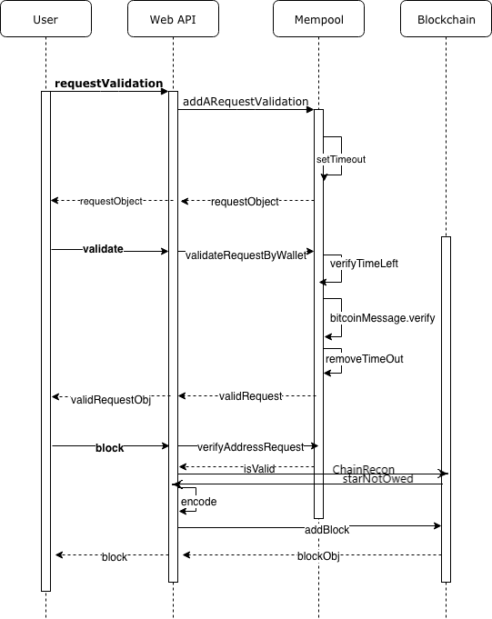

# Private Block Chain 

Blockchain has the potential to change the way that the world approaches data. Develop Blockchain skills by understanding the data model behind Blockchain by developing your own simplified private blockchain.

## Architecture 

A basic blockchain architecture. This architecture follows what was taught in the lesson material. 

Changes were made to check if users star is already owned before writing star data to a block.



### Webapi

Connecting the user to the web appilication through six endpoints. Three are post and three are get. Post endpoints allow the validaition of a signature and if true, a block will be added to the chain with user data. All get endpoints search for a specific block/s by different values (Hash,address and height). These values are sent through URL encoding. Error handling was thought out as much as possible. From server problems to user having incorrect bitcoin wallet length. All errors are handled through myboom.

#### Post RequestValiation

Post requestValidation starts the validaiton process by the user sending there bitcoin address within the body of a http packet in json. This address is then passed to the (requestValidation) to create a mempool validaiton Block object this includes the message for signing. Validaiton block is send back to the user. 

#### Post message-signature/validation

Post message-signature uses address and signature sent by user to get varified by validateRequestByWallet within the mempool. This will return whether the address is allowed to own a star and sent has json to the user. The message is not sent with address and signature, rather message is found in the mempool found by the users address.

#### Post block

Post block will check if users address is valid to own a star by passing the users address to verifyaddressRequest in the mempool. If true then users star data is check to make sure its not already owned. This process is done by passing star data to ChainRecon in Blockchain. A list is returned containing the block that match the star data. If the list returned is empty then that requested star is not owned. A new block is created with body of the block being the address and star data sent by the user json. Star story is also encoded in hexedecaiml and sent to the user. Validation block is removed from the mempool.

#### Get stars/hash

A search method to get a speific block my hash. By passing the hash found in the URL to ChainRecon in blockchain with search pramater as "HASH". This will return a list that contains the block that matches the hash. If the list contains nothing, then hash diddn't match any blocks.


#### Get stars/address

*Note simuler to stars/hash*

A search method to get a speific block my address. By passing the address found in the URL to ChainRecon in blockchain with search pramater as "ADDRESS". This will return a list that constain all the blocks that match the address. If the list contains nothing, then address diddn't match any blocks.

The big difference with this method is a address could own multiple star. While the other methods only search for a specific block.

#### Get block

A search method to get a speific block my height. By passing the height found in the URL to getBlock in blockchain returning the block. If users height is out of range of the current chain then a error will accour telling the user the height or if any block exist.

---

### Error Handling (MyBoom.js) 

A basic error handling class made specificly for express. Handles all http errors for the api, with a custom message and error code. The error code allows for identify and alleviating any problems a user might have.

---

### Mempool  

Allows the validation of a bitcoin address within a set period of time (5 minutes). Then by verifing the address, signature and message, allows that address to be validated and granted access to create a new block. Contains three classes validationBlock, validationStatus and Mempool. A important library was needed in mempool.js called bitcoinjs-message, allowing for the verifing of address.

ValidationBlock class repesents the starting request that will timeout inside the mempool and is returned when requestValidation in mempool is called.

ValidationStatus class repersents valdation status of the block and is returned from validateRequestByWallet in mempool. Is added inside the same ValidationBlock.  

Mempool class creates and manages validationBlocks in the mempool (a list). The Mempool class has five important functions.

<u>TimeTracker:</u> Allows for validation blocks to have a updated validationWindow when called.

<u>requestValidation:</u> Allow for address to request a validaiton window. Will prevent multiple request by the same address. The Object itself that is add to the mempool is {id:address,validationBlock} and a timing-out function that will delete the request by the id. The ValidaitonBlock is returned when called.
```javascript
self.mempool.push({id:request.walletAddress,request},setTimeout(function(){ self.removeValidation(request.walletAddress); },TimingWindow)); // auto removing in 5 min from mempool  
```

<u>removeValidation:</u> Removes a validationBlock from mempool by address. Called out by either the setTimeout inside the mempool or when a user has successful registered a star.

<u>validateRequestByWallet:</u> Uses address,signature and message within bitcoinMessage.verify to return a bool value representing the addresses is under correct ownership. The bool value is then added to a new validationStatus object. The object is then added to the mempool within the same requestblock and returned.

<u>varifyAddressRequest:</u> Checksum to verify address has been signed and is valid. Allowing address to own a star 

---

### Blockchain 

Manages the blockchain, can create new blocks, validates a single block or inter chain. Also reposnible for find height or a specific block. Currently im only using three functions within this class.

<u>addblock:</u> AddBlock function takes in a block object. Then checking the height of the saved chain determines a genesis block or exsiting block. If height is zero, there are no blocks on the chain therefore a genesis block will be created. Otherwise the last block of the saved chain is used to link the new block to the chain.

<u>getBlock:</u> Middle function connecting the api to leveldb. Uses getLevelDBData to return a specific block.

<u>ChainRecon:</u> Middle function connecting the api to leveldb. Uses getChain to return a list of matching block/s.

---
### levelSandBox

Contains leveldb class, this allows blocks on the chain to be persistent. The functions within the class are asynchronous meaning multiple operations can occur at once.

---

## Getting Started 

### Electrum / Postman

*Tested with postman 6.6.1*
*Tested with electrum 3.2.3* new version of electrum use a different encoding  

Any applicaion that has Base58 encoded address and allows for signing messages 

Posting data is sent with raw body data encoded with application/JSON

### Needed librarys
    npm -i level                // database
    npm -i sanitize             // clean user input 
    npm -i express              // web server   
    npm -i body-parser          // used with express
    npm -i crypto-js            // used for hashing blocks
    npm -i bitcoinjs-message    // used for verify address 


### Running the server
Starting the web server
first cd into project repository ``` cd Project_4 ```

run
```
node api.js
```
The server will be listing on 8000 for a client connection.
socket: http://localhost:8000/

*No blocks will exist on the chain when you first run*

---

## Endpoints \ requester a star 

### 1st send a request 

Validation request will only contain your Base58 bitcoin address in json.
JSON key being  "address"

POST : http://localhost:8000/requestValidation

Example input 
```json
{
	"address":"1D3uSMA151f93mS824USmwPSoTeyzGD7Ec"	
}
```

Example output
```json
{
    "walletAddress": "1D3uSMA151f93mS824USmwPSoTeyzGD7Ec",
    "requestTimeStamp": "1546925504",
    "message": "1D3uSMA151f93mS824USmwPSoTeyzGD7Ec:1546925504:starRegistry",
    "validationWindow": 300
}
```

### 2nd Message Signature & Validation

If you did the first step correcly you should have a message (address:epoch timestape:starReqistry). Next go to your bitcoin wallet manager of choice and used the same address to sign the message. 

Example of signing a message


Now take your address and newly created signature and create a new post with a JSON body 

POST : http://localhost:8000/message-signature/validate

Example input 
```json 
{
	"address":"1D3uSMA151f93mS824USmwPSoTeyzGD7Ec",
	"signature":"HxU1E2dulpsJwdWnnICqThDNIWj2OuTUTr5ynZ+Tgd+PAiqAEjVphShVfl33U1oBySya6a6PGH5ImPPRm9Rj4A0="
}
```

Check to make sure registerStar is true and messageSignature is also true. If both are true you are ready to move to the next step.

Example Output 
```json 
{
    "registerStar": true,
    "status": {
        "address": "1D3uSMA151f93mS824USmwPSoTeyzGD7Ec",
        "requestTimeStamp": "1546925504",
        "message": "1D3uSMA151f93mS824USmwPSoTeyzGD7Ec:1546925504:starRegistry",
        "validationWindow": 254,
        "messageSignature": true
    }
}
```

### 3rd creating a new block on the chain and requesting a star

Now we will be creating a new post request with nested JSON of are address and star data.

POST: http://localhost:8000/block

Example input
```json
{
    "address": "1D3uSMA151f93mS824USmwPSoTeyzGD7Ec",
    "star": {
                "dec": "98° 53' 56.9",
                "ra": "16h 29m 1.0s",
                "story": "Found star using https://www.google.com/sky/"
    }
}
```

Example output
```json
{
    "hash": "02f16856eecdca11b68131c4b2c2b627d774a31434dcf9d0fd678bc70ef3ad70",
    "height": 5,
    "body": {
        "address": "1D3uSMA151f93mS824USmwPSoTeyzGD7Ec",
        "star": {
            "dec": "98° 53' 56.9",
            "ra": "16h 29m 1.0s",
            "story": "466f756e642073746172207573696e672068747470733a2f2f7777772e676f6f676c652e636f6d2f736b792f"
        }
    },
    "time": "1546925582",
    "previousBlockHash": "6ce20ebb7f7703d944d92a49a51c2f3f28af8577b885f6b315b86e962c3e5b5a"
}
```
If you get expected output then you successfully created a new block and requested a star

## Error Codes

    110: Server problem 
    111: Could be address is not base58 encoded